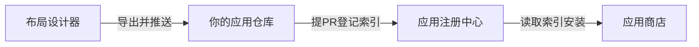

# 从布局设计到应用商店：端到端流程

本文说明：**用 M20 Layout Designer 导出可运行应用工程 → 补全业务逻辑 → 推送到 GitHub → 向本注册中心提 PR → 在 M20 应用商店中安装** 的完整路径。

- `app.json` 字段规范（应用仓库内）：以 [M20-AppStore 文档 `quick_start_github.md`](../../M20-AppStore/docs/quick_start_github.md) 为单一来源。
- 若各仓库在 GitHub 上**相互独立**（非同一 monorepo），请将下文中的相对链接替换为你组织下的仓库地址；同目录 monorepo 开发时可直接点击相对路径。

---

## 流程概览

下面两种方式表达同一流程。**本地编辑器若只显示灰色代码块、没有变成图**，属于正常现象：默认 Markdown 预览往往不支持 Mermaid。可在 **GitHub 网页**打开本文件查看渲染后的流程图，或安装带 Mermaid 预览的扩展。

**文字版（任意环境可读）：**

```
布局设计器  →  导出工程并推送到 GitHub  →  向注册中心提 PR（写入索引）  →  应用商店拉取索引并安装
```

**Mermaid 图（GitHub / 支持 Mermaid 的预览中会显示为图）：**



---

## 前置条件

- GitHub 账号。
- 本机已按 [M20-Layout-Designer README](../../M20-Layout-Designer/README.md) 安装并运行设计器（`python -m m20_layout_designer`，浏览器访问 `http://127.0.0.1:8765/`）。
- 已安装 **M20-XML-GUI**（`m20gui`），以便预览与运行应用。

---

## 阶段一：在设计器中导出「完整应用工程」

设计器不仅支持单独下载 `ui.xml`，还支持 **导出工程 ZIP**（与 AppStore 示例应用同结构的最简工程）。

1. 在浏览器中完成界面布局（拖拽控件、设置属性、多页面等）。
2. 使用界面上的 **「导出工程」**（对应后端 `POST /api/export-project`），下载 ZIP。
3. 解压后典型包含：
   - `ui.xml`：界面定义
   - `main.py`：入口
   - `handlers.py`：事件处理（需你补全业务逻辑）
   - `app.json`：应用元数据
   - `pyproject.toml`：依赖（若使用 uv 等）
   - `README.md`：生成说明

实现细节可参考设计器源码中的 [`project_scaffold.py`](../../M20-Layout-Designer/m20_layout_designer/project_scaffold.py)。

**叙事要点**：你得到的是**可直接运行的工程骨架**；界面已在 `ui.xml` 中，**默认需要你动手的是 `handlers.py` 中的逻辑**（与 XML 里 `command`、控件 `id` 等对齐），并视需要修改 `app.json`（名称、版本、图标路径等）。

---

## 阶段二：本地开发与自测

1. 在解压目录中安装依赖（按工程内 `README.md` 或 `pyproject.toml`，通常含 `uv`）。
2. 运行：`python main.py`（或文档说明的命令）。
3. 在 `handlers.py` 中实现按钮回调、定时任务等；若只改界面，可重新在设计器中编辑并 **导出 ui.xml**，覆盖工程中的同名文件即可。

`app.json` 必填字段与禁止项见 [quick_start_github.md](../../M20-AppStore/docs/quick_start_github.md)。

---

## 阶段三：将应用推送到 GitHub（独立应用仓库）

1. 新建一个 GitHub 仓库（例如 `M20-your-app`），将工程根目录推送到该仓库。
2. 确保仓库根目录存在：
   - `app.json`
   - `main.py`（或与 `app.json` 中 `main_file` 一致的入口）
3. 可选：发布 **GitHub Release** 并提供 ZIP 下载链接；若索引里使用 `download` 直链，可在注册中心条目中填写该 URL（见 [M20-app README](../README.md) 示例）。否则可使用 `download: null`，由商店从 `repo` 拉取。

---

## 阶段四：向注册中心（本仓库）提 PR

应用**代码**在独立仓库；**上架信息**在 `M20-app` 中维护。

1. Fork 本注册中心仓库（`M20-app`）到你的账号下。
2. 编辑本仓库根目录的 `apps_index.json`，在 `apps` 数组中增加一条，至少包含：
   - `app_id`：唯一标识
   - `repo`：应用仓库 HTTPS URL
   - `download`：可选，ZIP 直链或 `null`
   - `icon_url`：相对于本仓库的图标路径，如 `icons/your_app_id.png`
   - `main_file`：入口脚本，如 `main.py`
   - 以及 `name`、`version`、`description` 等展示字段（见 [README 示例](../README.md)）。
3. 将应用图标放到 `icons/<app_id>.png`（建议 256×256 或 512×512）。
4. 提交 **Pull Request**；合并后，远程应用商店即可从注册中心拉取该应用条目。

---

## 阶段五：在应用商店中安装

1. 在运行 M20-AppStore 的机器上，将注册中心仓库 URL 配置到 `appstore/config.py` 的 `GITHUB_REPOS`（见 [GitHub 快速开始](../../M20-AppStore/docs/quick_start_github.md)）。
2. 启动应用商店，刷新远程应用列表，找到你的应用并安装、启动。

---

## 与桌面启动器（Launcher）的关系

[M20-Launcher](../../M20-Launcher/README.md) 通过扫描 **`.desktop`** 展示与启动应用，不直接读取 `app.json`。应用经商店安装后，通常会由商店侧生成快捷方式；端到端流程中只需知道：**上架与元数据在注册中心 + 应用仓库；设备上的入口表现由 `.desktop` 衔接**。

---

## 链接与仓库布局说明

- 本文档中的 `../../M20-...` 路径适用于 **本地将 M20 各仓放在同一父目录下的开发**（monorepo 工作区）。
- 若各仓库单独克隆到不同路径，请改为打开对应仓库的 README / 文档。
- 在 **GitHub 网页** 上单独浏览 `M20-app` 仓库时，相对路径无法跨仓库跳转；请改用各仓库的完整 GitHub URL，或在本组织文档中统一维护导航页。
